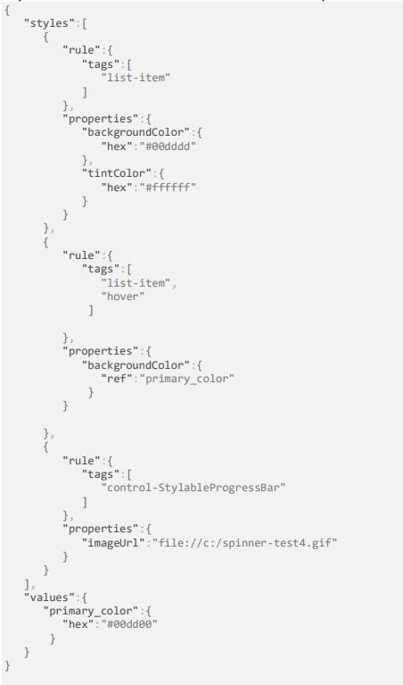

# GetStyle API

## Overview
The Transmit SDK GetStyle API enables the customization of the appearance of screens during the execution of Transmit flows. Specifically, at runtime, the API retrieves styles from a JSON stylesheet and applies them to the screen's UI elements, similar to applying styles from a CSS stylesheet. The JSON stylesheet is stored on the client side and can be customized to reflect the client brand colors, ensuring that the Transmit flow screen remains consistent with the client's website visual identity. 

## Tags

Both the API query and the JSON stylesheet use _tags_ to identify each UI element. A tag may consist of a single tag or a group of tags, with each tag representing a specific characteristic or feature of the UI element, such as its type, context of use, state, and others. The larger the tag set is, the more specific both the UI element usage and the corresponding rule's case of application are. The example above shows the possible structure of tags:

| UI element                       | Tag                              |
| -------------------------------- | -------------------------------- |
| H1 title                         | [`title`]                      |
| Authentication screens’ H1 title | [`title`, `password-screen`]     |
| Save button                      | [`button`, `save-button`]        |
| Save button (hover)              | [`button`, `save-button`, `state`] |

## JSON stylesheet 

### Structure

The JSON stylesheet consists of a collection of _style rules_, and styling _values_. 

_Style rules_ are flexible structures that can be designed to respond to specific contexts of use. The more specific the context to use a style is, the more complex the style rule becomes. For instance, a style rule may target the hover state of a validation button on a specific screen.

Each style rule includes:
- a _rule_ that identifies UI element types, characteristics, or features using _tags_ (see [`tags` field](#fields)) and thus determines the conditions for its application.
- a set of _properties_ that either identify formatting styles (see [`properties` field](#fields)) or refer to styling properties from the _values_ collection.

The `Values` object contains a centralized collection of styling values that can be referenced by the rule properties instead of being duplicated, enabling their reuse across multiple contexts. For example, `values`  may identify the brand identity colors to be used as the main color palette for the website's backgrounds, page titles, menu items, and more. Centralizing values within the `values` object ensures consistency and easy maintenance of the stylesheet. 

```
styles
    style
        rule
            tags
        properties
    style
        rule
            tags
        properties
    ...
    values
        styling value 1
        styling value 2
        ...
```
The JSON stylesheet is stored on the client side and then customizable by the client.

### Fields

| Field                | Nested in            | Description                                             | Data type | Mandatory |
| -------------------- | -------------------- | ------------------------------------------------------- | --------- | --------- |
| `styles `          | -                   | Collection of style rules                                  | array     | YES       |
| `rule`             | `styles `          | Style rule that defines the condition to apply the rule (see `tags`), and the rule's style properties (see `properties`)  | object    | YES       |
| `tags `            | `rule `            | Tag that specifies the UI elements to style                                     | array     | YES       |
| `properties`       | `rule `            | Formatting properties to style the UI elements. It can either specify a CSS formatting property o reference a styling variable (see `values`).          | object    | YES       |
| `values `          | -                  | Styling values that can be referenced by the style rule properties         | object    | YES       |

## Query processing
At query time, the GetStyle API queries the JSON stylesheet with the tags that identify the screen’s UI elements. The SDK then scans the JSON stylesheet in cascade order to find style rules that contribute to formatting the UI elements.

A style rule applies when its tag set matches the query tag set. If multiple style rules apply and the properties they qualify are complementary, they all participate in formatting the UI element.

### Tag matching criteria

During query processing, the query tag is key for evaluating style rule applicability. In fact, for a style rule to apply in formatting a UI element, its entire tag set must be contained within the query tag set. As a result:
- Style rules with smaller tag sets are considered a match if their tag set is contained within the query tag.
- Style rules with larger tag sets are ignored.

**Example** 
In the following table, "A, B, C" are symbolic placeholders for tags.

| Query tag | Style rule tag | Match |
|-----------|----------------|----------|
| `[A, B, C]` | `[A]` | YES |
| `[A, B, C]` | `[B]` | YES |
| `[A, B, C]` | `[A, B]` | YES |
| `[A, B, C]` | `[B, C]` | YES |
| `[A, B, C]` | `[A, B, C]` | YES |
| `[A, B, C]` | `[A, B, C, D]` | NO |


### Property application

To ensure complete formatting of the UI elements, all properties of applicable rules apply. If multiple rules qualify the same property, the properties from the last applicable rule in the stylesheet file take precedence and override the previous ones.

The same criterion applies to style rules whose properties refer to styling values from the `values` collection.


**Example** 
In the following table "A, B, C" are symbolic placeholders for tags, and "1, 2, 3" are symbolic placeholders for properties.

| Query tag | Style rule tag | Style rule properties  |
|-----------|----------------|-----------------------| 
| `[A, B, C]` | `[A]` | `[1, 2]` |
| `[A, B, C]` | `[A, B]` | `[3, 4]` |
| `[A, B, C]` | `[B, C]` | `[5, 6]` |
| `[A, B, C]` | `[A, B, C]` | `[5, 6, 7]` |

The properties displayed at runtime are `1`, `2`, `3`, `4`, `5`, `6`, and `7`. 
Although properties `5` and `6` are qualified by both `[B, C]` and `[A, B, C]` style rules, `[A, B, C]`'s properties override `[B, C]`'s, as they are the last ones referenced in the stylesheet.

## In-context example

In the JSON stylesheet above, for an API query referencing the `[list-item, hover]` tag set, both the first and second rules apply, as both tag sets are contained in the query tag set.

As both styles reference the `BackgroundColor` property, the BackgroundColor style of the second rule takes precedence because it is the last one referenced in the stylesheet. 

As a result, the applied properties are:
- First rule's `tintColor`
- Second rule's `BackgroundColor` (note that the property refers to the `primary-color` value from the `values` collection)


